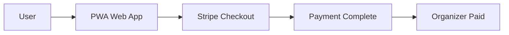

# Payment & App Store Compliance Strategy

## Executive Summary

klub's payment strategy leverages the "physical goods and services" exemption (Apple App Store Guidelines 3.1.5) to avoid the 30% Apple tax while maintaining compliance. We use Stripe Connect for all payments, ensuring organizers receive instant payouts.

## App Store Guidelines Analysis

### What Apple Allows (3.1.5 Physical Goods & Services)

✅ **Allowed with External Payment:**
- Physical event tickets (concerts, workshops, meetups)
- In-person services (coaching, consulting, classes)
- Physical merchandise (t-shirts, books, swag)
- Venue rentals and space bookings
- Food and beverage orders for events

### What Apple Restricts (3.1 Digital Content)

❌ **Requires In-App Purchase (30% fee):**
- Digital content (videos, courses, ebooks)
- Virtual events with no physical component
- Digital subscriptions for content access
- Virtual goods or currencies
- Premium app features

## klub's Compliance Strategy

### Phase 1: PWA First (Months 1-3)
**No App Store = No Restrictions**



Benefits:
- Full payment freedom
- 3-5% transaction fees only
- Instant deployment
- No approval process

### Phase 2: Native Apps (Months 4-6)
**Careful Feature Selection**

```typescript
// payment-compliance.service.ts
@Injectable()
export class PaymentComplianceService {
  // Determine if item requires IAP
  requiresInAppPurchase(item: PurchasableItem): boolean {
    const digitalOnlyTypes = [
      'digital_course',
      'video_content',
      'virtual_membership',
      'app_premium_features',
    ];
    
    return digitalOnlyTypes.includes(item.type);
  }

  // Route to appropriate payment method
  async processPayment(item: PurchasableItem): Promise<PaymentResult> {
    if (this.requiresInAppPurchase(item)) {
      // Must use IAP (30% fee)
      return this.processWithInAppPurchase(item);
    } else {
      // Can use Stripe (3-5% fee)
      return this.processWithStripe(item);
    }
  }
}
```

## Detailed Payment Flow

### Event Ticket Purchase (Compliant)

```typescript
// Event ticket purchase - Physical good exemption
interface EventTicket {
  type: 'physical_event' | 'hybrid_event';
  venue: {
    name: string;
    address: string;
    city: string;
    coordinates: [number, number];
  };
  physicalComponent: string; // "In-person attendance at venue"
}

async function purchaseEventTicket(ticket: EventTicket): Promise<Order> {
  // Validate physical component
  if (!ticket.venue || !ticket.physicalComponent) {
    throw new Error('Physical events require venue details');
  }

  // Process with Stripe (not IAP)
  const session = await stripe.checkout.sessions.create({
    payment_method_types: ['card'],
    line_items: [{
      price_data: {
        currency: 'usd',
        product_data: {
          name: ticket.name,
          description: `Physical event at ${ticket.venue.name}`,
          metadata: {
            type: 'physical_event',
            venue: ticket.venue.name,
          },
        },
        unit_amount: ticket.price,
      },
      quantity: 1,
    }],
    mode: 'payment',
    success_url: `${BASE_URL}/success?session_id={CHECKOUT_SESSION_ID}`,
    cancel_url: `${BASE_URL}/event/${ticket.eventId}`,
    metadata: {
      eventId: ticket.eventId,
      userId: ticket.userId,
      type: 'physical_event_ticket',
    },
  });

  return session;
}
```

### Membership Subscription (Careful Positioning)

```typescript
// Membership with physical benefits - Compliant
interface CommunityMembership {
  type: 'community_membership';
  benefits: {
    physical: string[]; // Must have physical benefits
    digital: string[];  // Can include digital as bonus
  };
}

const compliantMembership: CommunityMembership = {
  type: 'community_membership',
  benefits: {
    physical: [
      'Access to monthly in-person meetups',
      'Member-only coworking space access',
      'Physical welcome package',
      'Discount on event tickets',
    ],
    digital: [
      'Community forum access', // Bonus, not primary
      'Member directory',        // Bonus, not primary
    ],
  },
};
```

## Risk Mitigation Strategies

### 1. Clear Value Proposition Documentation

```typescript
// Every purchasable item must document its physical component
interface PurchasableItem {
  id: string;
  name: string;
  price: number;
  type: 'physical_event' | 'service' | 'merchandise' | 'membership';
  physicalComponent: string; // Required for compliance
  digitalComponent?: string; // Optional bonus
  complianceNotes: string;  // Internal documentation
}
```

### 2. App Store Review Preparation

```markdown
## App Store Review Response Template

Dear App Review Team,

klub facilitates transactions for physical goods and services per Guidelines 3.1.5:

1. **Event Tickets**: All events have physical venues and in-person attendance
2. **Services**: Coaching, consulting, and classes occur in-person
3. **Memberships**: Include physical benefits (venue access, events, merchandise)

We use external payment processing (Stripe) solely for these physical transactions, 
similar to apps like Eventbrite, Uber, and Airbnb.

Digital features (forums, chat) are community tools, not sold separately.

Attached: Documentation showing physical nature of all transactions.
```

### 3. Dual Payment System (If Required)

```typescript
// Hybrid approach if Apple insists
class HybridPaymentService {
  async processPayment(item: PurchasableItem, platform: Platform) {
    // Web/PWA: Always use Stripe
    if (platform === 'web') {
      return this.stripePayment(item);
    }

    // iOS: Route based on item type
    if (platform === 'ios') {
      if (this.isDigitalOnly(item)) {
        return this.applePayment(item); // 30% fee
      } else {
        return this.stripePayment(item); // 3-5% fee
      }
    }

    // Android: Always use Stripe (Google more lenient)
    return this.stripePayment(item);
  }
}
```

## Implementation Guidelines

### Do's ✅

1. **Emphasize Physical Components**
   - Always highlight venue/location
   - Include physical addresses
   - Show maps in event listings
   - Document in-person aspects

2. **Clear Communication**
   ```typescript
   // Event description template
   const eventDescription = `
     Join us IN-PERSON at ${venue.name}
     📍 Location: ${venue.address}
     🎟️ Physical attendance required
     🤝 Network with attendees face-to-face
   `;
   ```

3. **Proper Categorization**
   ```typescript
   enum EventType {
     IN_PERSON = 'in_person',        // ✅ Stripe
     HYBRID = 'hybrid',               // ✅ Stripe (has physical)
     VIRTUAL_ONLY = 'virtual_only',   // ⚠️ May require IAP
   }
   ```

### Don'ts ❌

1. **Avoid Digital-Only Language**
   - Don't say "streaming access"
   - Don't emphasize "online content"
   - Don't sell "digital passes"

2. **Don't Mix Payment Types**
   ```typescript
   // BAD: Mixing digital and physical in one transaction
   const badBundle = {
     items: [
       { type: 'physical_ticket', price: 50 },
       { type: 'digital_course', price: 100 }, // Problem!
     ],
   };

   // GOOD: Separate transactions
   const physicalTransaction = {
     items: [{ type: 'physical_ticket', price: 50 }],
     processor: 'stripe',
   };

   const digitalTransaction = {
     items: [{ type: 'digital_course', price: 100 }],
     processor: 'in_app_purchase',
   };
   ```

## Stripe Connect Implementation

### Organizer Onboarding

```typescript
// Stripe Connect setup for instant payouts
async function onboardOrganizer(organizerId: string): Promise<StripeAccount> {
  const account = await stripe.accounts.create({
    type: 'express',
    country: 'US',
    capabilities: {
      card_payments: { requested: true },
      transfers: { requested: true },
    },
    business_type: 'individual',
    business_profile: {
      product_description: 'Community events and services',
    },
    settings: {
      payouts: {
        schedule: {
          interval: 'manual', // Instant payouts on request
        },
      },
    },
  });

  // Generate onboarding link
  const accountLink = await stripe.accountLinks.create({
    account: account.id,
    refresh_url: `${BASE_URL}/organizer/onboarding`,
    return_url: `${BASE_URL}/organizer/dashboard`,
    type: 'account_onboarding',
  });

  return { account, onboardingUrl: accountLink.url };
}
```

### Payment Processing

```typescript
// Process payment with instant payout to organizer
async function processTicketPurchase(
  ticket: Ticket,
  organizer: Organizer,
  buyer: User
): Promise<PaymentResult> {
  // Create payment intent with application fee
  const paymentIntent = await stripe.paymentIntents.create({
    amount: ticket.price * 100, // Convert to cents
    currency: 'usd',
    application_fee_amount: Math.round(ticket.price * 0.035 * 100), // 3.5% platform fee
    transfer_data: {
      destination: organizer.stripeAccountId,
    },
    metadata: {
      ticketId: ticket.id,
      eventId: ticket.eventId,
      buyerId: buyer.id,
      type: 'physical_event_ticket',
    },
  });

  return {
    clientSecret: paymentIntent.client_secret,
    organizerPayout: ticket.price * 0.965, // 96.5% to organizer
    platformFee: ticket.price * 0.035,     // 3.5% platform fee
  };
}
```

## Compliance Monitoring

### Automated Checks

```typescript
// Automated compliance validation
@Injectable()
export class ComplianceMonitor {
  @Cron('0 * * * *') // Hourly
  async validateListings(): Promise<ComplianceReport> {
    const events = await this.eventRepository.find();
    const issues = [];

    for (const event of events) {
      // Check for physical component
      if (!event.venue || !event.address) {
        issues.push({
          eventId: event.id,
          issue: 'Missing physical venue',
          severity: 'high',
        });
      }

      // Check for problematic language
      const digitalKeywords = ['streaming', 'digital-only', 'online-access'];
      if (digitalKeywords.some(keyword => 
        event.description.toLowerCase().includes(keyword)
      )) {
        issues.push({
          eventId: event.id,
          issue: 'Contains digital-only language',
          severity: 'medium',
        });
      }
    }

    return { issues, checkedAt: new Date() };
  }
}
```

## Fallback Strategies

### If Apple Rejects

1. **Plan A: Documentation**
   - Provide detailed evidence of physical components
   - Show similar approved apps (Eventbrite, Meetup)
   - Emphasize service nature

2. **Plan B: Feature Adjustment**
   - Remove purely digital offerings
   - Enhance physical components
   - Add venue requirements

3. **Plan C: Hybrid Model**
   - Use IAP for digital content
   - Keep Stripe for physical events
   - Clear user communication

4. **Plan D: Web-Only Features**
   - Some features only on PWA
   - Mobile app for discovery/community
   - Payments through web browser

## Success Metrics

### Compliance KPIs
- App Store approval rate: >95%
- Payment dispute rate: <0.5%
- Compliance violations: 0
- Platform fee collection: 98%+

### Financial Impact
- Average transaction fee: 3.5% (vs 30% with IAP)
- Organizer satisfaction: >90%
- Payment processing time: <2 seconds
- Payout time to organizers: <48 hours

## Legal Considerations

### Terms of Service Language

```markdown
## Payment Processing

klub facilitates payments for physical events, in-person services, 
and merchandise. We are a marketplace connecting organizers with 
members for real-world experiences.

Digital features (forums, chat, member directory) are communication 
tools included with physical community membership, not sold separately.

All transactions are processed by Stripe, a PCI-compliant payment 
processor. klub retains 3.5% as a platform fee to cover operational costs.
```

### Privacy Policy Addendum

```markdown
## Payment Data

We do not store credit card information. All payment data is 
processed and secured by Stripe according to PCI DSS standards.

We collect only necessary transaction metadata:
- Transaction amount and date
- Event or service purchased
- Buyer and seller identification
- Physical venue information
```

## Conclusion

klub's payment strategy prioritizes:
1. **Compliance** with App Store guidelines
2. **Low fees** for organizers (3.5% vs 30%)
3. **Fast payouts** via Stripe Connect
4. **Clear positioning** as physical goods/services

By starting with PWA and carefully structuring our offerings around physical events and services, we can maintain favorable payment terms while providing value to communities.